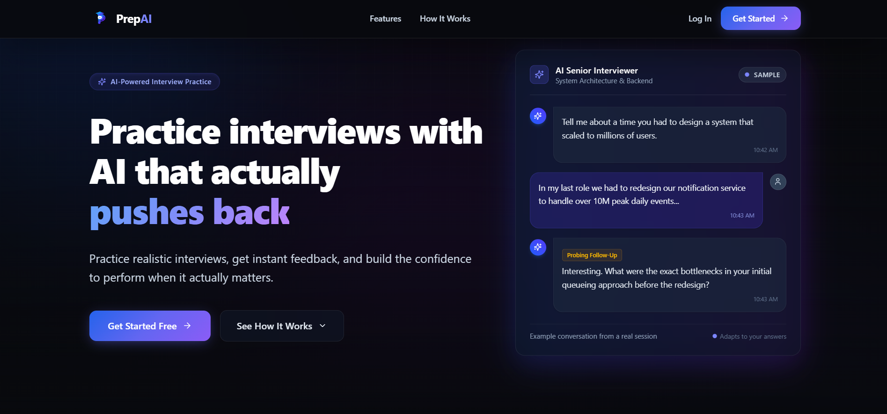
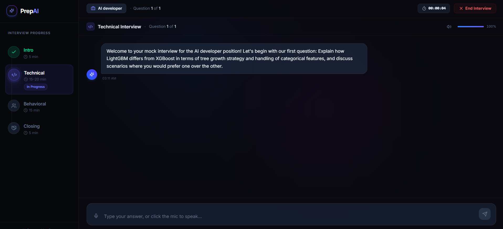

@'
# PrepAI — Practice Interviews with AI That Actually Pushes Back

PrepAI is an AI-powered mock interview platform that generates personalized interview questions from your resume, conducts a realistic voice/text interview, reacts to your actual answers in real time, and produces a detailed scored feedback report at the end.

## Features

- **Resume-based question generation** — upload your resume and target role; PrepAI generates tailored technical, behavioral, and resume-specific questions using Groq (`openai/gpt-oss-120b`).
- **Realistic AI interviewer** — the AI reacts specifically to what you actually said (not generic "Good job!" responses), and gives corrective feedback on weak or vague answers.
- **Voice-enabled** — answer by speaking (browser speech recognition) or typing; the AI's questions are read aloud via ElevenLabs text-to-speech.
- **Staged interview flow** — Intro -> Technical -> Behavioral -> Closing, each with its own time limit.
- **Detailed feedback report** — technical score, communication score, an overall summary, and specific improvement areas with suggested better answers.
- **Session history & dashboard** — track past interviews and see your progress over time.

## Tech Stack

**Frontend:** React, TypeScript, Vite, Tailwind CSS, Framer Motion
**Backend:** FastAPI, SQLAlchemy, PostgreSQL (Neon), LangGraph
**AI/ML:** Groq (LLM inference), ElevenLabs (text-to-speech)
**Auth:** JWT-based authentication

## Getting Started

### Prerequisites

- Python 3.11+
- Node.js 18+
- A PostgreSQL database (e.g. Neon)
- API keys: Groq, ElevenLabs

### Backend Setup

```bash
cd backend
pip install -r requirements.txt --break-system-packages
cp .env.example .env
python create_tables.py
python -m backend.main
```

Backend runs at `http://localhost:8000`.

### Frontend Setup

```bash
cd frontend
npm install
npm run dev
```

Frontend runs at `http://localhost:5173`.

## Screenshots

### Landing Page


### Live Interview Session


## Roadmap

- [ ] Session recovery after browser refresh/crash
- [ ] Rate limiting and cost controls on LLM calls
- [ ] Expanded auth hardening
- [ ] Additional interview question categories

## Author

Built by Muhammad Sami
'@ | Set-Content -Path README.md -Encoding UTF8
